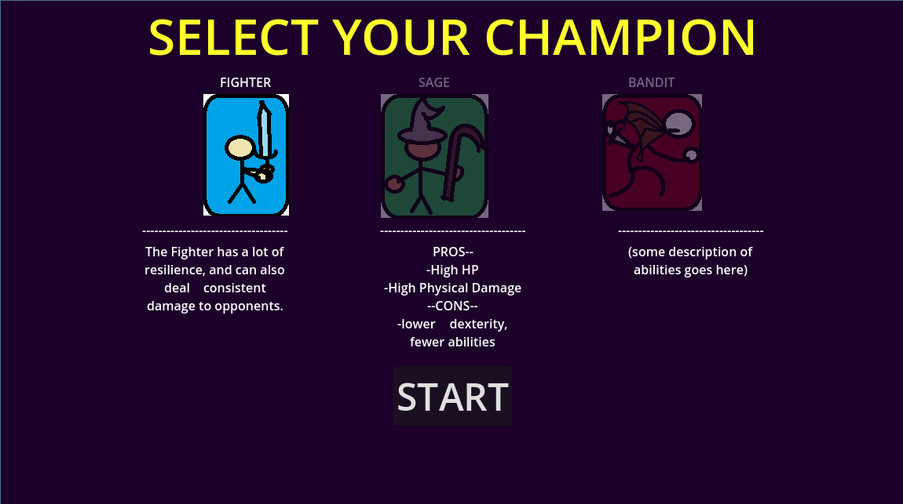
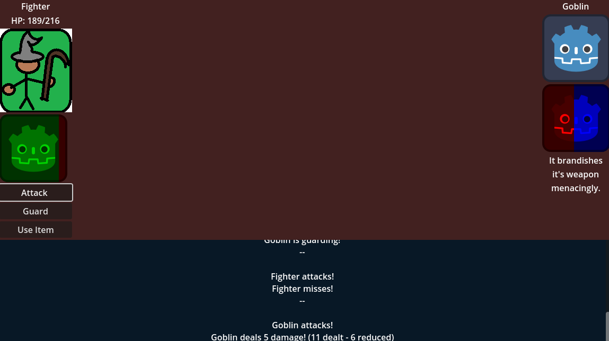
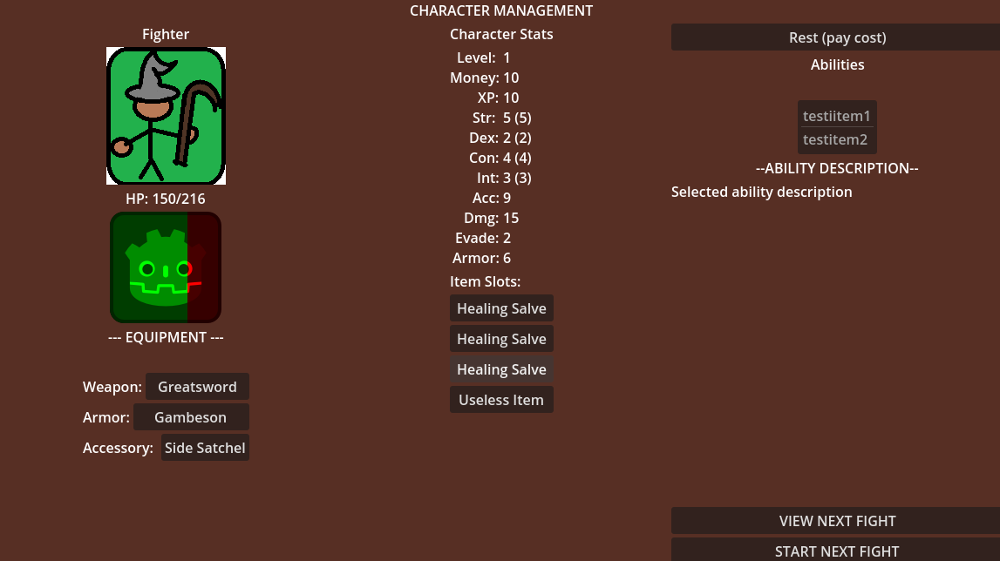

# UI Fights
# RPG Turn-Based Battle Tech Demo

## Overview

This is a tech demo for an RPG turn-based battle system developed using the Godot Engine, and in the spirit of games such as Sinjid / Sonny.  This is mostly practice for future projects in Godot, and exploring what can be done with the built-in UI tools for the engine.



## Features

- **Unique "AI Personality" System**: Enemies have set personalities that dictate probable strategies in combat based on their mood.
- **Character Selection**: Choose from multiple characters with unique stats (and abilities!)(soon).
- **Turn-Based Combat**: 
- **Basic Attack and Skills**: Perform basic attacks and use items during combat.
- **Custom stats**: Track health points and apply damage calculations.
- **User Interface**: Simple UI for displaying character stats and battle information.



## Getting Started

### Prerequisites

- [Godot Engine](https://godotengine.org/download) (version 4.4.1 and up needed)

### How to use

1. Clone the repository:
   ```bash
   git clone https://github.com/yourusername/rpg-turn-based-battler.git
	```
2. Open the project in Godot

3. Press 'F5' (e.g. Run the project)

That's all for now.  The intent is to get a sequence of battles with breaks to manage/upgrade your character in between them to have a "complete" demo before closing this out.


	
	
